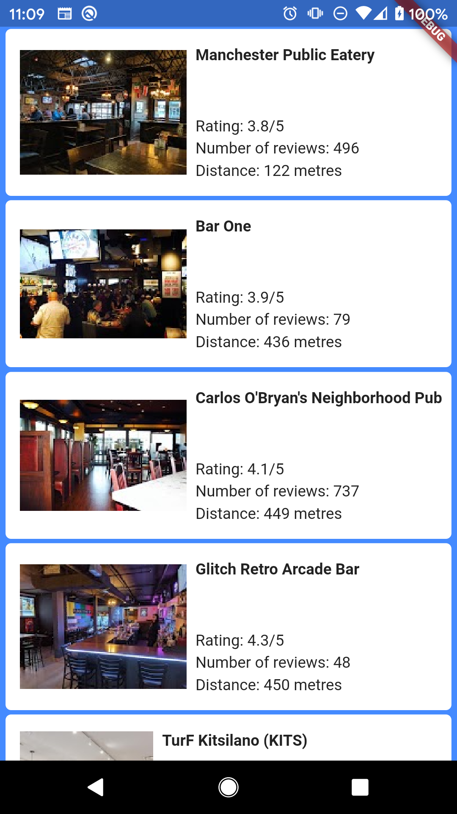

# where are the bars at?

A Flutter application to find the nearest bars to your location

## Description

Created this project as a personal two day hackathon for my application to a company, might continue to develop this further.

## Current Functionality

- Load list of the 20 closest bars using google maps API
- To get the closest bars to a users location, location is retrieved using geolocator API
- Calculate the distance from your location to each of the bars
- Display the list of bars in a list view, from retrieved JSON data from the google maps API
- Retrieve an image of the bars to display along with the name and other data on a list tile
- "Pull to refresh" Using Liquid Pull To Refresh API

#### My website: [www.oziguerra.com](https://oziguerra.com)
